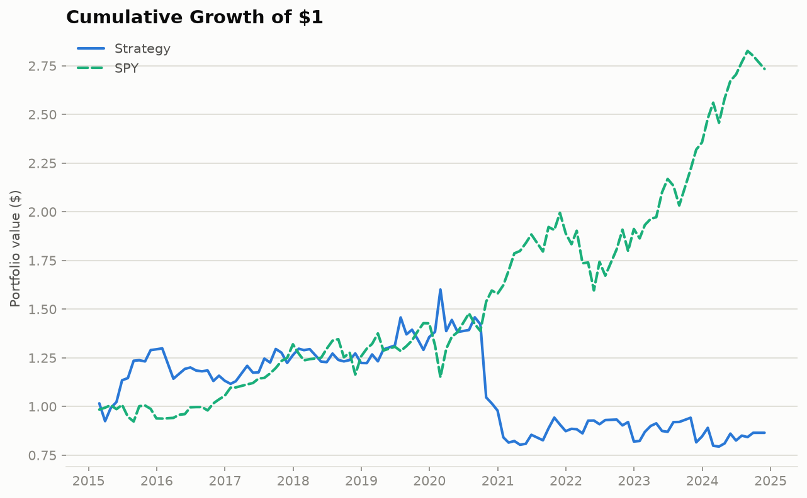

# Factor Backtester

[](https://github.com/robbasnet14/factor-backtester/actions/workflows/tests.yml)

A backtesting engine for long/short equity factor strategies. Each month it ranks
stocks by momentum, value, and quality, buys the best ones, shorts the worst, and
simulates the whole thing on point-in-time data with trading costs — so the numbers
are something you can actually trust.

I built this to understand how factor strategies really behave once you stop cheating:
no peeking at the future, no quietly dropping companies that went bankrupt, no
pretending trading is free. Honestly, most of the work went into *not* fooling myself,
which turns out to be the hard part of backtesting.

## What it does

- Rebuilds the S&P 500 as it actually existed on each date, delisted names included,
  so there's no survivorship bias. (Sanity check I keep coming back to: Lehman shows up
  as a member until it blows up in 2008 and then disappears, which is exactly right.)
- Pulls prices from Yahoo Finance with a Tiingo fallback for delisted names, and
  fundamentals straight from SEC EDGAR (TTM diluted EPS, book value, ROE).
- Computes three factors per stock, per month: 12-1 momentum, earnings yield (value),
  and ROE (quality); standardizes each date's cross-section and blends them.
- Goes long the top decile, short the bottom decile, rebalances monthly, and charges
  8 bps per trade based on turnover (or, with `cost_model: per_name`, a volatility-scaled
  cost per name). Only names that actually traded on the rebalance
  date are ranked, so a delisted company can't be bought or held after it's gone.
- Reports the honest version of performance: out-of-sample Sharpe from a walk-forward
  test, a deflated Sharpe that accounts for how many configurations I tried, plus
  drawdown, turnover, and factor coverage.

## Results

S&P 500, 2010–2024, monthly rebalance, equal-weight top-decile-long / bottom-decile-short,
8 bps per-trade cost. The **out-of-sample** column (walk-forward, 10 folds) is the number
that matters; the in-sample column is shown only for reference.

| Metric | Out-of-sample (headline) | In-sample (reference) |
|---|---|---|
| Annualized return | −1.6% | −0.1% |
| Annualized volatility | 19.3% | 16.7% |
| Sharpe ratio | 0.02 | 0.08 |
| Deflated Sharpe (probability) | 0.52 | 0.62 |
| Max drawdown | −50.4% | −46.4% |
| Avg monthly turnover | 39.1% | 38.9% |
| Hit rate | 56.0% | 54.8% |

Mean factor coverage across rebalance dates: composite score 91%, value-and-quality 71%.

**Cost sensitivity** — the same portfolios under three cost assumptions (printed by every
run). The headline uses the flat 8 bps because it's the model with the fewest assumptions:
you can sanity-check 8 bps without trusting my volatility proxy.

| Cost model | OOS return | OOS Sharpe | OOS max drawdown | Deflated Sharpe | In-sample Sharpe |
|---|---|---|---|---|---|
| Gross (no costs) | −1.2% | 0.04 | −49.6% | 0.547 | 0.10 |
| Flat 8 bps (headline) | −1.6% | 0.02 | −50.4% | 0.521 | 0.08 |
| Per-name, volatility-scaled | −1.7% | 0.01 | −50.6% | 0.515 | 0.08 |

These numbers are after a correctness fix: earlier versions could hold a delisted name in
a month it never traded (50 position-months, booked at a flat 0%). Excluding untradable
names moved the out-of-sample return from −1.4% to −1.6% and max drawdown from −48.9% to
−50.4%; the Sharpe stayed at 0.02.



### What this means

The honest answer: **a naive momentum/value/quality long–short has no edge in large-cap
US equities — not after costs, and not before them either.** Out of sample the Sharpe is
essentially zero (0.02) and the return is slightly negative, with a deep drawdown. Even
in-sample it's weak (0.08). The deflated Sharpe — which asks whether a result could just
be luck given how many variants you tried — sits around 0.5, basically a coin flip.

Costs aren't what kills it. With trading costs set to zero the out-of-sample Sharpe is
0.04 and the return is still negative (−1.2% a year); costs take roughly another 0.4
percentage points a year on top of that. There was no gross edge for costs to eat. That's
a stronger finding than "it works but trading is too expensive": the composite signal
itself doesn't separate future winners from losers in this universe and period. This
backtest can't tell me *why* — factor decay, crowding, or a too-naive equal-weight blend
are all candidates — only that the answer isn't costs.

That's a legitimate finding, not a broken project. The whole point of building this
carefully — point-in-time universe, no look-ahead, real costs, walk-forward validation,
deflated Sharpe — was to get an answer I could trust, and a version that looked great
would more likely mean a bug than a discovery.

## Layout

```
src/
  data/       price + fundamentals loading (Yahoo/Tiingo + SEC EDGAR), point-in-time universe
  features/   factor calculations and cross-sectional standardization
  backtest/   portfolio construction, cost model, engine, walk-forward
  analytics/  performance metrics, coverage report, equity-curve chart
scripts/run_backtest.py   the entry point that wires it all together
tests/        76 tests, network-mocked
config.yaml   every knob (universe, dates, costs, factors, validation)
```

## Reproducing this

Prices come from Yahoo Finance (no key). Fundamentals come from SEC EDGAR (no key, but it
wants a descriptive User-Agent, which is set in the loader). A Tiingo key is optional and
only used as a price fallback for a few delisted names — set `TIINGO_KEY` if you have one.

```bash
python -m venv .venv && source .venv/bin/activate   # Windows: .venv\Scripts\activate
pip install -r requirements.txt
python scripts/run_backtest.py --config config.yaml
```

The first run pulls and caches data (slow), and records permanently-unavailable tickers in
`data_cache/*.json` so later runs skip them. Every run after the first reads the cache and
is quick. Outputs land in `outputs/`.

### With Docker

```bash
docker build -t factor-backtester .
docker run --rm \
  -v "$(pwd)/data_cache:/app/data_cache" \
  -v "$(pwd)/outputs:/app/outputs" \
  factor-backtester
```

The `data_cache` mount keeps downloaded data on your machine, so reruns reuse it instead
of downloading everything again; the `outputs` mount is where the CSVs and charts land.
Add `-e TIINGO_KEY` to pass through a Tiingo key if you have one.

## Some honest caveats

- **Value coverage is ~71%.** Fundamentals are missing for some renamed/delisted tickers,
  and a few multi-share-class names (e.g. Visa) tag EPS in a custom way SEC's API doesn't
  expose. Momentum/quality coverage is higher (~91% composite).
- **Delisting payouts aren't modeled.** A name that stops trading while held is exited at
  its last traded price (37 position-months); 4 of those never traded again after entry, so
  they're booked at 0%. What shareholders actually received — a takeover premium or a
  bankruptcy loss — isn't in free price data (it needs something like CRSP delisting
  returns), so the direction of this bias is unclear, but it touches very few of the
  ~15,900 position-months.
- **Costs are a flat 8 bps per trade in the headline** — a reasonable stand-in, not the
  truth; real costs vary by name and size.
- **The per-name cost model is a proxy for the wrong variable.** It scales cost with each
  name's trailing 63-day volatility (the median name pays 8 bps), because volatility is the
  only cost-relevant signal in the data. But spreads are driven mainly by liquidity, not
  volatility: a high-volatility mega-cap is still cheap to trade and a low-volatility thin
  name isn't. There's no volume data here, so it can't be modeled properly. It also scales
  within each date, so a market-wide crisis doesn't raise costs across the board. And the
  scaling is linear (a name with 3× the median volatility pays 3× the cost), which is an
  assumption rather than an estimate: if spreads rise less than proportionally with
  volatility, as is often found, it overstates costs for the most volatile names.
- **The "embargo" in the walk-forward is a settling gap, not an ML-style leakage guard,**
  because the factors are fixed formulas with nothing trained. There's a note in
  `validation.py`.
- Early-year (2010) coverage is lower because more of that era's names were later
  renamed or delisted.

## Tests

```bash
python -m pytest tests/
```

76 tests, all network-mocked except one opt-in live SEC integration check. They cover the
easy-to-get-wrong stuff: momentum's skip-month, the point-in-time fundamentals lag, the
delisted-name universe, never holding a name on a date it didn't trade, turnover cost math, the yfinance→Tiingo fallback, and — the one I
care about most — a test proving the engine trades on *forward* returns, never
contemporaneous ones.

CI runs the suite on both pandas 2.2 and 3.x, since `requirements.txt` allows either and
they differ in ways that matter here: on 2.x, `pct_change` forward-fills a missing price
by default, which silently suppressed the engine's missing-price warning. One test checks
that the warning still fires.

For a step-by-step walkthrough of checking the tests and the real pipeline yourself, see
[VERIFYING.md](VERIFYING.md).

## Still to do

- A liquidity-based cost model (e.g. square-root impact on dollar volume), which needs
  volume data the loader doesn't store yet.
- A couple more factors (low-vol, size) to see how the mix changes.
