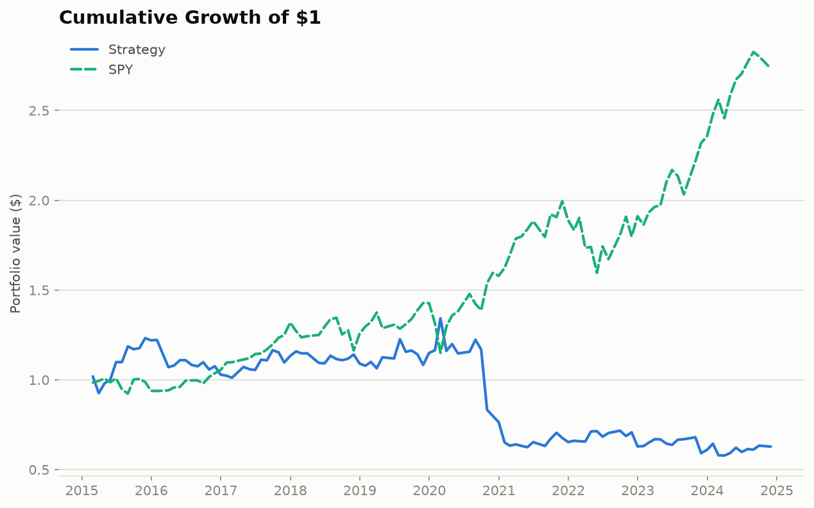

# Factor Backtester

[](https://github.com/robbasnet14/factor-backtester/actions/workflows/tests.yml)

A backtesting engine for long/short equity factor strategies. Each month it ranks
stocks by momentum, value, and quality, buys the best ones, shorts the worst, and
simulates the whole thing on point-in-time data with trading costs — so the numbers
are something you can actually trust.

I built this to understand how factor strategies really behave once you stop cheating:
no peeking at the future, no quietly dropping companies that went bankrupt, no
pretending trading is free. Honestly, most of the work went into *not* fooling myself,
which turns out to be the hard part of backtesting.

**Used in a follow-up study:** [ml-vs-linear-factors](https://github.com/robbasnet14/ml-vs-linear-factors)
takes this engine's linear factor composite as the baseline and asks whether a
pre-registered, walk-forward, cost-aware machine-learning model can beat it. (Short
answer: no, not on the pre-registered terms — the apparent edge traces to a single
12-month fold and doesn't survive a proper multiple-testing correction.) That repo
vendors a snapshot of this engine's code as of commit `31b92b4` here (brought in by its
own commit `eac614c`); this repo remains the maintained, independently-evolving version.
The snapshot predates the tradability fix, the per-name cost model and the value-factor
split/dividend fix (see Corrections below), so its baseline numbers differ from the ones
here.

## What it does

- Rebuilds the S&P 500 as it actually existed on each date, delisted names included,
  so there's no survivorship bias. (Sanity check I keep coming back to: Lehman shows up
  as a member until it blows up in 2008 and then disappears, which is exactly right.)
- Pulls prices from Yahoo Finance with a Tiingo fallback for delisted names, and
  fundamentals straight from SEC EDGAR (TTM diluted EPS, book value, ROE).
- Computes three factors per stock, per month: 12-1 momentum, earnings yield (value),
  and ROE (quality); standardizes each date's cross-section and blends them. Earnings
  yield compares EPS and price per the same share: every quarter's EPS is restated across
  later stock splits, and the price is split-adjusted but not dividend-adjusted.
- Two more factors ship as plugins, off by default: low volatility (trailing daily-return
  volatility, window ending the day before each rebalance) and size (market cap from SEC
  shares outstanding, cross-checked against reported public float). A factor is one file
  in `src/factor_backtester/features/plugins/`; the registry finds it, and `config.yaml` switches it on.
- Goes long the top decile, short the bottom decile, rebalances monthly, and charges
  8 bps per trade based on turnover (or, with `cost_model: per_name`, a volatility-scaled
  cost per name). Only names that actually traded on the rebalance
  date are ranked, so a delisted company can't be bought or held after it's gone.
- Reports the honest version of performance: out-of-sample Sharpe from a walk-forward
  test, a deflated Sharpe that accounts for how many configurations I tried, plus
  drawdown, turnover, and factor coverage.

## Results

S&P 500, 2010–2024, monthly rebalance, equal-weight top-decile-long / bottom-decile-short,
8 bps per-trade cost. The **out-of-sample** column (walk-forward, 10 folds) is the number
that matters; the in-sample column is shown only for reference.

| Metric | Out-of-sample (headline) | In-sample (reference) |
|---|---|---|
| Annualized return | −5.0% | −4.4% |
| Annualized volatility | 19.3% | 16.8% |
| Sharpe ratio | −0.16 | −0.18 |
| Deflated Sharpe (probability) | 0.31 | 0.24 |
| Max drawdown | −56.9% | −53.1% |
| Avg monthly turnover | 42.3% | 42.1% |
| Hit rate | 47.7% | 46.4% |

Mean factor coverage across rebalance dates: composite score 91%, value-and-quality 71%.

**Cost sensitivity** — the same portfolios under three cost assumptions (printed by every
run). The headline uses the flat 8 bps because it's the model with the fewest assumptions:
you can sanity-check 8 bps without trusting my volatility proxy.

| Cost model | OOS return | OOS Sharpe | OOS max drawdown | Deflated Sharpe | In-sample Sharpe |
|---|---|---|---|---|---|
| Gross (no costs) | −4.6% | −0.14 | −56.2% | 0.334 | −0.15 |
| Flat 8 bps (headline) | −5.0% | −0.16 | −56.9% | 0.308 | −0.18 |
| Per-name, volatility-scaled | −5.1% | −0.17 | −57.1% | 0.302 | −0.18 |

### Corrections

These numbers are after two correctness fixes; earlier versions of this README reported
better ones.

1. **Untradable holdings.** Earlier versions could hold a delisted name in a month it never
   traded (50 position-months, booked at a flat 0%). Excluding untradable names moved the
   out-of-sample return from −1.4% to −1.6%; the Sharpe stayed at 0.02.
2. **A look-ahead leak in the value factor.** Earnings yield divided EPS *as filed* by a
   price adjusted for every split and dividend up to the download date. After a 4-for-1,
   earlier EPS sits on the old share basis while the price is divided by four, so every
   stock that went on to split looked cheaper than it was, by exactly its future split
   factor: NVDA by 40× in 2015. Stocks that split are mostly stocks that rose, so the value
   factor ranked future winners as cheap. The dividend adjustment did the same, more
   mildly, to future dividend payers. Summing pre- and post-split quarters into a TTM also
   produced artifacts such as AAPL's EPS "falling" 61% after its 2020 split, and a derived
   NVDA quarter showing a −$1.09 loss when it earned $1.18. Now each quarter's EPS is
   restated across later splits (a change of units, so no look-ahead) and compared with a
   split-adjusted, not dividend-adjusted, price. Walk-forward out-of-sample, attributed:

   | | Return | Sharpe |
   |---|---|---|
   | Before the fix | −1.6% | 0.02 |
   | Same code on re-downloaded data (revisions in the source data only) | −1.8% | 0.01 |
   | Dividend part of the fix only | −3.3% | −0.07 |
   | Split part of the fix only | −4.4% | −0.13 |
   | Both (current) | −5.0% | −0.16 |

   The leak was worth about 0.17 of Sharpe, almost all of the difference.



### What this means

The honest answer: **a naive momentum/value/quality long–short has no edge in large-cap
US equities — not after costs, and not before them either.** Out of sample the Sharpe is
slightly negative (−0.16) and the return is −5% a year, with a deep drawdown; in-sample
it's no better (−0.18). The deflated Sharpe — the probability that the true Sharpe is
above zero, given how many variants were tried — is 0.31: no evidence of an edge, and
nothing significant in the negative direction either.

Costs aren't what kills it. With trading costs set to zero the out-of-sample Sharpe is
−0.14 and the return is still −4.6% a year; costs take roughly another 0.4 percentage
points a year on top of that. There was no gross edge for costs to eat. That's
a stronger finding than "it works but trading is too expensive": the composite signal
itself doesn't separate future winners from losers in this universe and period. This
backtest can't tell me *why* — factor decay, crowding, or a too-naive equal-weight blend
are all candidates — only that the answer isn't costs.

That's a legitimate finding, not a broken project. The whole point of building this
carefully — point-in-time universe, no look-ahead, real costs, walk-forward validation,
deflated Sharpe — was to get an answer I could trust, and a version that looked great
would more likely mean a bug than a discovery.

## Layout

```
src/factor_backtester/
  data/       price + fundamentals loading (Yahoo/Tiingo + SEC EDGAR), point-in-time universe
  features/   factor formulas, standardization, and the factor registry (one plugin file per
              factor in features/plugins/, found automatically)
  backtest/   portfolio construction, cost model, engine, walk-forward
  analytics/  performance metrics, coverage report, equity-curve chart
scripts/run_backtest.py   the entry point that wires it all together
tests/        138 tests, network-mocked
config.yaml   every knob (universe, dates, costs, factors, validation)
```

## Reproducing this

Prices come from Yahoo Finance (no key). Fundamentals come from SEC EDGAR (no key, but it
wants a descriptive User-Agent, which is set in `src/factor_backtester/data/providers/sec_edgar.py`). A Tiingo key is optional and
only used as a price fallback for a few delisted names — set `TIINGO_KEY` if you have one.

```bash
python -m venv .venv && source .venv/bin/activate   # Windows: .venv\Scripts\activate
pip install -r requirements.txt
python scripts/run_backtest.py --config config.yaml
```

The first run pulls and caches data (slow), and records permanently-unavailable tickers in
`data_cache/*.json` so later runs skip them. Every run after the first reads the cache and
is quick. Outputs land in `outputs/`.

If a data source fails for some tickers (a network error, a rate limit) rather than having
no data for them, the run stops before backtesting and lists them. Everything that did load
is cached by then, so running again only asks for those. `--allow-partial` continues without
them instead and prints the missing tickers before and after the results. Dropping one
ticker is enough to move the headline: without MSFT the OOS Sharpe is −0.15 instead of −0.16.

### With Docker

```bash
docker build -t factor-backtester .
docker run --rm \
  -v "$(pwd)/data_cache:/app/data_cache" \
  -v "$(pwd)/outputs:/app/outputs" \
  factor-backtester
```

The `data_cache` mount keeps downloaded data on your machine, so reruns reuse it instead
of downloading everything again; the `outputs` mount is where the CSVs and charts land.
Add `-e TIINGO_KEY` to pass through a Tiingo key if you have one.

## Some honest caveats

- **Value coverage is ~71%.** Fundamentals are missing for some renamed/delisted tickers,
  and a few multi-share-class names (e.g. Visa) tag EPS in a custom way SEC's API doesn't
  expose. Momentum/quality coverage is higher (~91% composite).
- **Delisting payouts aren't modeled.** A name that stops trading while held is exited at
  its last traded price (36 position-months); 4 of those never traded again after entry, so
  they're booked at 0%. What shareholders actually received — a takeover premium or a
  bankruptcy loss — isn't in free price data (it needs something like CRSP delisting
  returns), so the direction of this bias is unclear, but it touches very few of the
  ~15,900 position-months.
- **Six names have no split history, so no value score.** BBBY, BK, CSRA, EQR, HOT and
  NFX are cached from before split data was stored, and neither Yahoo nor Tiingo returns
  their history any more. They keep their cached prices for returns and momentum, but
  their EPS can't be restated, so they get no earnings yield (248 name-months) rather
  than one on a guessed share basis.
- **Size covers 70.2% of universe name-months, and its exclusions are mostly data
  errors.** Market cap (SEC shares outstanding x split-adjusted close) is set to NaN
  unless it lies between 0.01x and 100x the company's latest reported public float.
  That gate drops 1,219 name-months across 61 names (524 below, 695 above, including
  359 where the reported float is zero); another 223 name-months across 10 names have a
  reported share count of zero, and 3,190 across 280 names have no float to check
  against (2,198 of them in the first 15 months, before the first 10-K in the window).
  The bounds come from where errors and genuine values separate in this data, not from
  a rule: real values reach 0.04x (a 96% fall since the float date) and 22x (founder
  holdings outside SEC's float definition), while errors are orders of magnitude off
  (counts scaled by 1,000 or 1,000,000, BRK.B's Class A count priced at the Class B
  price). It can't catch smaller errors (ZTS sits at ~0.07x), and when the two figures
  disagree it can't tell which is wrong: where the float is the bad one (HST, WAT), a
  correct market cap is dropped. Multi-class companies are the structural limit: one
  price series per ticker can't give sum(shares x price) across classes.
- **Ticker symbols aren't permanent identifiers.** Sources reassign delisted symbols to
  new companies: re-downloading turned up several whose symbol now returns a different
  company's recent history, and the previous cache held a different security under COL.
  The cache refuses a download that doesn't cover what it already holds, which catches
  the partial-history case, but only a permanent security identifier (like CRSP's PERMNO)
  would guarantee a symbol means the same company throughout.
- **Costs are a flat 8 bps per trade in the headline** — a reasonable stand-in, not the
  truth; real costs vary by name and size.
- **The per-name cost model is a proxy for the wrong variable.** It scales cost with each
  name's trailing 63-day volatility (the median name pays 8 bps), because volatility is the
  only cost-relevant signal in the data. But spreads are driven mainly by liquidity, not
  volatility: a high-volatility mega-cap is still cheap to trade and a low-volatility thin
  name isn't. There's no volume data here, so it can't be modeled properly. It also scales
  within each date, so a market-wide crisis doesn't raise costs across the board. And the
  scaling is linear (a name with 3× the median volatility pays 3× the cost), which is an
  assumption rather than an estimate: if spreads rise less than proportionally with
  volatility, as is often found, it overstates costs for the most volatile names.
- **The "embargo" in the walk-forward is a settling gap, not an ML-style leakage guard,**
  because the factors are fixed formulas with nothing trained. There's a note in
  `validation.py`.
- Early-year (2010) coverage is lower because more of that era's names were later
  renamed or delisted.

## Tests

```bash
python -m pytest tests/
```

138 tests, all network-mocked except one opt-in live SEC integration check. They cover the
easy-to-get-wrong stuff: momentum's skip-month, the point-in-time fundamentals lag, the
delisted-name universe, never holding a name on a date it didn't trade, EPS restated across
splits (checked against AAPL's and NVDA's real filings), turnover cost math, the
yfinance→Tiingo fallback, a failed download stopping the run instead of quietly dropping
the name, and — the one I
care about most — a test proving the engine trades on *forward* returns, never
contemporaneous ones.

CI runs the suite on both pandas 2.2 and 3.x, since `requirements.txt` allows either and
they differ in ways that matter here: on 2.x, `pct_change` forward-fills a missing price
by default, which silently suppressed the engine's missing-price warning. One test checks
that the warning still fires.

For a step-by-step walkthrough of checking the tests and the real pipeline yourself, see
[VERIFYING.md](VERIFYING.md).

## Still to do

- A liquidity-based cost model (e.g. square-root impact on dollar volume), which needs
  volume data the loader doesn't store yet.
